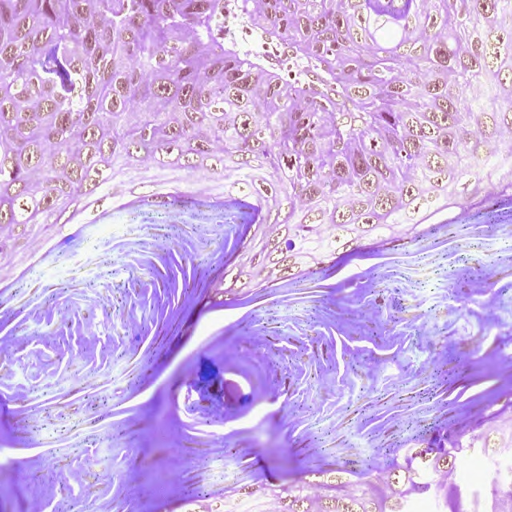
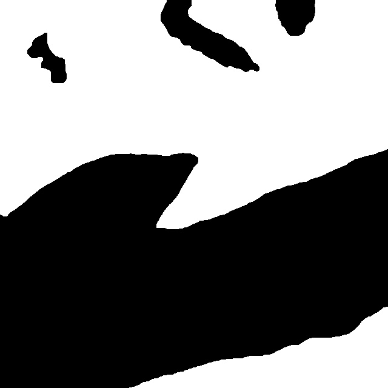
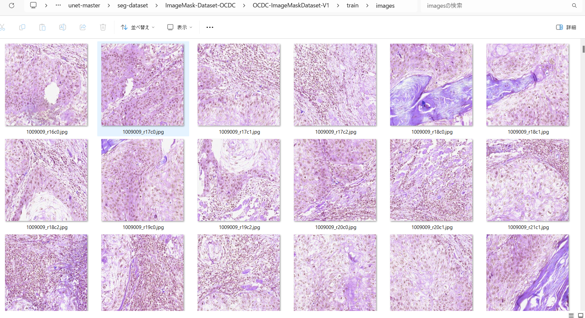
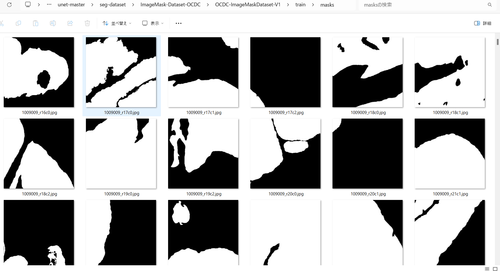
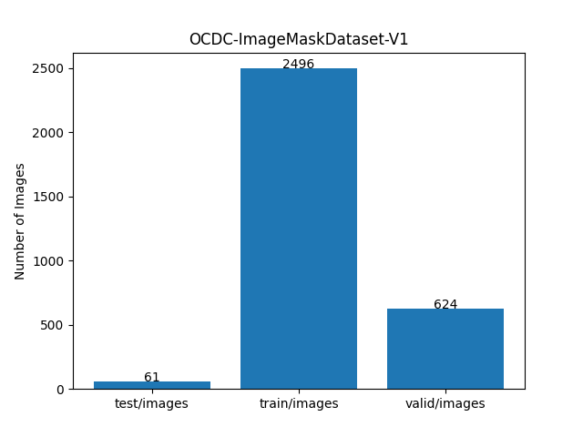

<h2>ImageMask-Dataset-OCDC (2024/05/05) </h2>
This is a simple ImageMask Dataset for Oral Cavity-Derived Cancer(OCDC) Image Segmentation. 
The dataset used here has been taken from the following <a href="https://data.mendeley.com/datasets/9bsc36jyrt/1">
Mendeley Data 
H&E-stained oral squamous cell carcinoma histological images dataset</a>. 
 
<b>Image and mask sample</b> 

<table>
<tr>
<th>
Image 
</th>
<th>
Mask
</th>
</tr>
<td>

</td>
<td>

</td>
</table>

 
You can download our augmented 640x640 jpg dataset generated here from the google drive 
<a href="https://drive.google.com/file/d/1vhCpb8V5vnBwNRKGk6HhFjpoUFOg2laX/view?usp=sharing">OCDC-ImageMask-Dataset-V1.zip</a>.
 

<h3>1. Dataset Citation</h3>

The dataset used here has been taken from the following <a href="https://data.mendeley.com/datasets/9bsc36jyrt/1">
Mendeley Data 
H&E-stained oral squamous cell carcinoma histological images dataset</a>. 

<pre>
Freire, Dalí; Faria, Paulo; Loyola, Adriano; Cardoso, Sergio; 
Travencolo, Bruno; do Nascimento, Marcelo (2022), 
“H&E-stained oral squamous cell carcinoma histological images dataset”, 
Mendeley Data, V1, doi: 10.17632/9bsc36jyrt.1
</pre>

Please see also:<a href="./MendeleyData_OCDC_2022.pdf">MendeleyData_OCDC_2022.pdf</a>
 

<h3>2. Download OCDC dataset </h3>
If you would like to generate your own dataset by yourself, please download the original one from 
the following <a href="https://data.mendeley.com/datasets/9bsc36jyrt/1">
Mendeley Data 
H&E-stained oral squamous cell carcinoma histological images dataset</a>. 
Please move the downloaded files under <b>ImageMask-Dataset-OCDC</b> directory, 
<pre>
./ImageMask-Dataset-OCDC
 ├─testing
 └─training
</pre>

The testing and training folders contain image and mask png files for testing and training respectively. 

<h3>3. Generate master dataset </h3>
Please move to <b>ImageMask-Dataset-OCDC</b> direcotory, and run the following commnad for Python script <a href="./ImageMaskDatasetGenerator.py">ImageMaskDatasetGenetator.py</a> to generate
images and masks jgp files. 
<pre>
>python ImageMaskDatasetGenerator.py 
</pre>
, by which <b>OCDC-master</b> datatset will be created by flipping, rotating, and distorting image augmentation processings. 
<pre>
./OCDC-master
  ├─images
  └─masks
</pre>
, and <b>OCDC-test</b> without augmentation. 
<pre>
./OCDC-test
  ├─images
  └─masks</pre>

<h3>4. Split master dataset </h3>
Please run the following command for Python script <a href="./split_master.py">split_master.py</a>.
<pre>
>python split_master.py
</pre>
, by wich test, train, and valid subdatasets will be created. 

<pre>
./OCDC-ImageMask-Dataset-V1
  ├─train
  └─valid
</pre>

<h3>5. Copy OCDC-test </h3>
Please run the following command for Python script <a href="./copy_test.py">copy_test.py</a>.
<pre>
>python copy_test.py
</pre>
, by wich OCDC-test folder will be copied to OCDC-ImageMask-Dataset-V1. 

Train images sample 
 
Train masks sample 
 

Dataset Statistics  

 

<h3>
References
</h3>

<b>1. WSI tumor regions segmentation</b> 
Dalí Freire  
<pre>
https://github.com/dalifreire/tumor_regions_segmentation
</pre>

